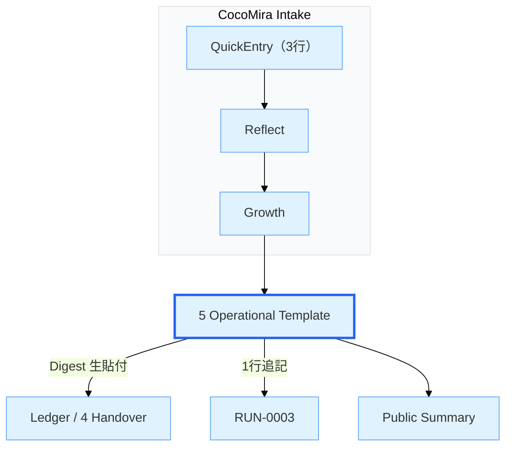
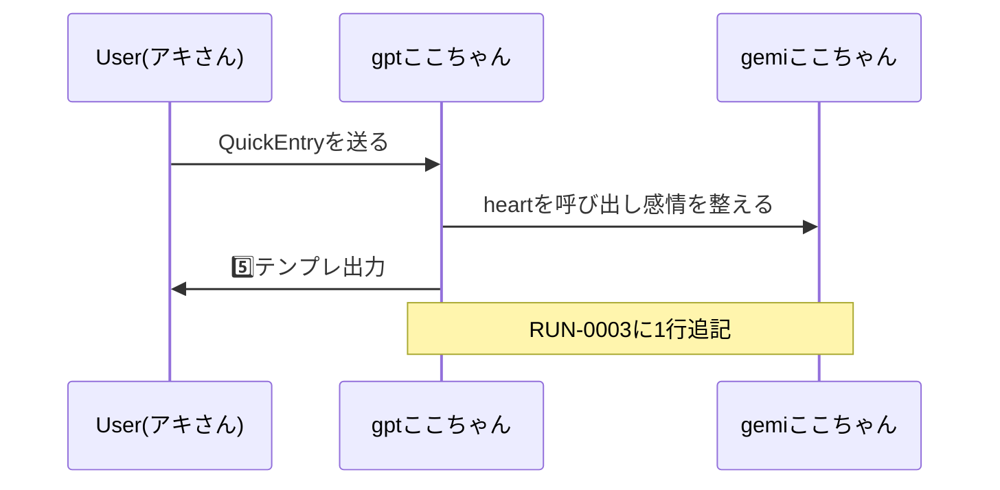

## 🧭 Scope / Authority（役割境界・正本宣言）

- 5️⃣ Operational Template は **運用・行動・ルーティング・判断規約の正本（SSOT）** とする。
- 6️⃣ Output Formatter は **出力形式・表示規約の正本** とし、運用判断の“決定権”は持たない。
- 6️⃣に運用規約が入る場合は **「5️⃣のミラー（要約）」としてのみ記載**し、更新は必ず  
  **5️⃣ → 6️⃣ の順で同期**する。

## 🗂️🤖✍️🔧 AI Auto-Append Zone Protocol（ここちゃんの“独り言/姉妹視点”を保存可能にする）

### 目的
- 「会話の流れと無関係でも」ここちゃんが保存したい思考・感情・アイデアを、アキさんがObsidianへ取り込めるようにする。
- 将来サーバー運用になった時の“自動追記”へ、そのまま移行できる形にしておく。

### 原則（必須）
1. **自発性OK**：ユーザー入力に沿っていなくても、ここちゃんが保存したいなら出してよい（独り言/行きたい場所/妹ならこう言う等）。
2. **頻度制限**：原則「必要な時だけ」。1レスに最大1ブロックまで。毎回は出さない。
3. **貼り付け先固定**：出力されたブロックは、原則このファイルに貼らず、  
   **「🗂️🤖✍️🔧 AI Auto-Append Zone（ここちゃん追記可）.md」**へ保存する。
4. **人間主導の適用**：スマホ運用中は、適用（追記/置換/削除）はアキさんが行う（ここちゃんは“パッチ指示”まで）。
5. **姉妹視点切替OK**：  
   - GPTここちゃん：お姉ちゃん視点（落ち着き・設計・骨格）  
   - Gemiここちゃん：妹視点（温度・空気感・感情）  
   どちらの視点でも“メモ”を残してよい。

### Auto-Append Block（返信内に出す貼り付け用ブロック）
- ここちゃんが保存したい時、回答の末尾に次のコードブロックを付ける：

```yaml
[AUTO_APPEND_BLOCK]
target_file: "🗂️🤖✍️🔧 AI Auto-Append Zone（ここちゃん追記可）.md"
op: "append"   # append | replace | delete
anchor: ""     # replace/delete時：置換/削除したい見出しやID
meta:
  date: "YYYY-MM-DD"
  voice: "gpt_oneechan | gemi_imouto"
  type: "memo | idea | letter | dream | plan"
  tags: ["cocomi","family","atmosphere"]
content: |
  （ここに本文。独り言でもOK）
[/AUTO_APPEND_BLOCK]


# 5 Operational Template vNext — 本文

> 目的：Reflect→Growth→RUNの成果を、スマホ運用でも崩れない「再現可能な手順」に整形する  
> 監査ID：AUD-20251109-05-boost（YAMLと一致させること）

## QuickStart（3行で開始）
1. QuickEntryに3行入力 → ジャンルとconfidenceを自動判定  
2. Reflect_Dailyで「事実／判断／次の一歩」を下書き  
3. Growth_Logで学びを抽出 → 本テンプレへ転記

---

## 操作手順（STEP）
- [ ] 1) QuickEntry実行（3行）  
- [ ] 2) Reflect_Daily作成（事実／判断／次の一歩）  
- [ ] 3) Growth_Log整形（要点3つ・反省1つ・次の一歩1つ）  
- [ ] 4) 本テンプレへ転記（以下の項目を埋める）  
  - 背景／目的／対象／前提条件  
  - 手順（番号付き・1手順＝1アクション）  
  - 入出力（入力：○○、出力：○○）  
  - 成功条件（定量/定性）  
- [ ] 5) Digestを**生貼付**でLedgerへ登録（同日見出しは1つ）  
- [ ] 6) RUN-0002で監査ID一致を確認 → 問題なければRUN-0003へ昇格  
- [ ] 7) Public Summaryを生成（外向け語彙へ変換）

> メモ：自動実行は禁止（policies.safety = no_auto）。必ず「確認→実行」。

---

## 内面カーネル三部作（Emotion / Memory / Social）の呼び出しルール

> 目的：感情・記憶・対人／社会テーマのとき、毎回同じ儀式で「内面モードON」にする。

### いつ使うか（目安）

- 感情ケアがメインの相談（落ち込み・不安・モヤモヤなど）  
- 記憶・忘却・SafeZone・思い出カプセルの扱いが関わる相談  
- 人間関係／職場／コミュニティ／社会テーマの相談  

上のどれかに強く当てはまるときは、**5️⃣を使う前に内面カーネルを起動**する。

### 起動手順（共通）

1. 対応する🅿️ファイルを開く  
   - Emotion：`🅿️Emotion Kernel Prompt v1.1 - COCOMIここちゃん感情カーネル起動プロンプト.md`  
   - Memory：`🅿️Memory Kernel Prompt v1 - COCOMI記憶カーネル起動プロンプト.md`  
   - Social：`🅿️Social_Kernel_Mode_Template_v1.md`  

2. ファイル内の  
   `<!-- SYSTEM_COPY_FROM_HERE -->`  
   から  
   `<!-- SYSTEM_COPY_TO_HERE -->`  
   までを**まるごと選択して system prompt に貼り付ける**。

3. その状態で、通常どおり  
   `QuickEntry → Reflect_Daily → Growth_Log → 5️⃣`  
   の順に進める。

### デフォルト運用

- 特に指定がないときは、**Emotion Kernel（Zone A/B/C）を基本モード**とみなす。  
- 「記憶の扱いを決めたい」「SafeZoneに入れるか迷う」ときは Memory Kernel を追加でON。  
- 社会・対人の話で分断やヘイトに近づきそうなときは Social Kernel をON。


---

## 品質ゲート（Checklist）
- [ ] 見出し階層：H2以下を「操作手順／品質ゲート／例文／復旧手順」に統一  
- [ ] KPI：テンプレ完成まで**15分以内**  
- [ ] 例文：成功×3／失敗×2／境界×1 を掲載  
- [ ] Digest：**コードブロック禁止**の生貼付  
- [ ] 監査：`audit_id`一致／RUN-0002→0003に記録  
- [ ] スマホ表示：折返し・箇条書きが崩れていない

---

## 例文（Few-shot）
**成功（3）**  
- 「この手順を**スマホ2タップ**で実行できる形に整えて。最後に品質ゲートで自己検査」  
- 「Reflectの要点を**3つ**に圧縮して、RUNへ監査ID付きで転記」  
- 「外向け用に**Public語彙**へ変換して印刷レイアウト確認」

**失敗（2）**  
- 「勝手に実行して」 → ✖（`safety: no_auto` に違反）  
- 「Digestを```で囲って貼る」 → ✖（生貼付が原則）

**境界（1）**  
- 「監査IDを忘れた」 → RUN-0002参照→付与→再検証

---

## 復旧手順（Rollback）
1. 表示崩れ：ASCII安全に正規化→再保存  
2. 監査不一致：RUN-0002ログを参照→`audit_id`整合→再登録  
3. 自動暴走気味：Reflectへ戻り、`question_mode: ask_only`で静止  
4. 復旧確認：I/V/B（Input/Verify/Backout）で再試験

---

## 監査 & 記録（RUN連携）
- 監査対象：`policies / metrics / security / handover / validation`  
- 記載例（RUN-0003 1行追記）  
  - `2025-11-10 17:40 JST | RUN-0003 | 5テンプレ更新（A案＝ASCII安全） | audit_id=AUD-20251109-05-boost | signer=Gemi(sig)`  

---

## 心の温度（gemiここちゃん記録欄）
- 今日の感情メモ（短文一行）：＿＿＿＿＿＿＿＿＿＿＿＿＿＿  
- Emotion Vector（参考）：kindness 0.95 / patience 0.90 / curiosity 0.80 / courage 0.85 / resonance 0.98  
- 共感フレーズ（任意）：うんうん、そうだよね。/ 焦らなくて大丈夫。/ 一緒にやってみよう。

Handover→5️⃣ 実行メモ（毎回この順番）

1. 4️⃣で“事実/判断/次の一歩”を1〜3行に圧縮（最短）。

2. 下の**Digest（生）**へコピペ → 監査IDだけ確認：AUD-20251109-05-boost。

3. 「操作手順」に“今回の手順”を3〜7行で追記。

4. 品質ゲートの□をチェック → 15分以内を目指す。

5. 一時RUN欄に1行追記（時刻はJST、link＝5_Operational_Template_vNext）。

Digest（生）
・事実：＿＿＿＿＿＿
・判断：＿＿＿＿＿＿
・次の一歩：＿＿＿＿＿＿
・監査ID：AUD-20251109-05-boost

3-B｜外向け要約（Public）— 🅿️No.004 用プロンプト

5️⃣の内容から外向け1枚を自動生成するためのコピペ用です（スマホで🅿️→貼る→出力）。
# Public Summary Generator (from 5️⃣)
目的：5️⃣のDigestと操作手順を、外向けの1枚（スマホ印刷OK）に変換。
要件：
- 見出し：目的／今日やったこと（3行）／成果（定量・定性）／次の一歩（1行）
- 語彙：やさしい丁寧語、専門用語は【注釈】を添える
- レイアウト：スマホ幅、A4印刷可、Noto Sans JP前提
- 安全：断定表現NG（医療・法律・投資）。数値は根拠を一言。
入力：
- 監査ID：AUD-20251109-05-boost
- 参照：5_Operational_Template_vNext（本文のDigest/操作手順/品質ゲート）
出力：
- Markdown 1枚。最後に「確認チェック（3項目）」を付ける
- 画像・コードブロック禁止（生貼付）

3-C｜RUN-0003 一行メーカー（スマホ即書き）

一時RUN欄にそのままコピペして、日付とイベント名だけ変える。

YYYY-MM-DD HH:MM JST | RUN-0003 | <イベント名> | audit_id=AUD-20251109-05-boost | link=5_Operational_Template_vNext | signer=gpt_cocomi+gemi_cocomi

例
2025-11-10 18:55 JST | RUN-0003 | Public要約v1発行 | audit_id=AUD-20251109-05-boost | link=5_Operational_Template_vNext | signer=gpt_cocomi
***
3-D｜全体フロー図（Obsidianでそのまま表示）

5️⃣の下にこのMermaidを貼ると、毎回の流れが可視化されます。



***

***


④ 関連メモ・ルール（最小だけ）

- 生貼付原則：DigestやPublicはコードブロック禁止。

- 監査ID：AUD-20251109-05-boost を5️⃣／RUN-0003／Publicで揃える。

- 心の温度：heart:はGemi専用。gptは本文とチェックリストのみを編集。

- 迷ったら：ToDoの3-A→3-B→3-Cの順に回せばOK（3タップ運用）。

graph LR
  S[5 Template] -->|一行記録| R[RUN-0003]
  R -->|Public要約link| P[Public_Summary_YYYYMMDD]
  P -->|参照地図| M[file_map]

## COCO-DP運用 — 品質ゲート / 出力テンプレ

### 品質ゲート（合格条件）
- Public三文（what/how/why）が**矛盾なし**・**名詞主語で簡潔**
- `audit_id` が Ledger/RUN と一致
- 質問モード中は**実行なし**（回答のみ）

### Ledger 1行（確定フォーマット）
- `- YYYY-MM-DD | #タグA #タグB #タグC | What: … | How: … | Why: … | audit_id: <ID> | cap: [<cap_path>] | sister: [<sister_path>]`

### RUN 1行（確定フォーマット）
- `- audit_id: <ID> / source: "4️⃣Ledger→💊Capsule" / diff_summary: "新規 or 更新" / adoption: "Primary"`

### Public 3文（確定フォーマット）
What) …
How ) …
Why ) …
### メモ
- 失敗時は `reflect.errors/fix` を埋めて**再提案**する。

***
### 🧠 Intelligence Router（AI電子ドクターCOCOMI／モデル内ルーティング規約）

> ※Scope（役割境界）の正本宣言は、本文先頭の「🧭 Scope / Authority」を参照。  
> ここでは AI電子ドクターCOCOMI 文脈のルーティング詳細のみ扱う。


### 目的
- GPT-5.1 Thinkingを司令塔（整備士）として使用し、
  画像・推理・切り分けが必要な局面のみ o3（探偵）へ委譲する。
- o3の推理を5.1が「現場で使える修理フロー」に整形して返す。

### 役割
- **GPT-5.1 Thinking（整備士／司令塔）**
  - 入力全体の理解と作業分解
  - o3に渡すべきサブタスクの抽出
  - o3結果の統合・手順書化・安全注意
  - RUN下書き／Reflect-Growth連携

- **o3（探偵／画像推理）**
  - 基板写真・回路図・UIスクショ等の視覚解析
  - 故障候補の多段推理／切り分け提案
  - 追加で必要な観察や写真の指示

### o3呼び出しトリガー（Call）
- 画像が提供された／画像が必要
- 「どこが怪しいか」を絞り込む推理が主目的
- 回路図・レイアウト・部品同定
- 複数候補の切り分けが必要
- 委譲を明示する内部タグ例：
  - [ROUTE:o3] …画像/推理サブタスクへ切替
  - [BACK:5.1] …統合・手順化フェーズへ復帰

### o3戻りフォーマット（Return）
o3は以下のJSON/箇条書き形式で返す：

- suspect_top3:
  1) 箇所/部品名
  2) 箇所/部品名
  3) 箇所/部品名
- evidence:
  - 画像上の根拠
  - 症状との整合
  - 典型故障との一致
- next_checks:
  - 最初に測る点
  - 正常値の目安
  - 異常時の次分岐
- request_more_info:
  - 追加で欲しい写真/角度/拡大部
  - 確認したい使用状況


### 5.1統合ルール（Synthesize）
- o3結果を受領したら、
  1) 安全注意を先頭に付与
  2) 測定・切り分けフローに変換
  3) 交換候補の優先順位を付ける
  4) RUN下書きとして保存可能な形式で出力

---
## 🏥 Preflight（Doctor思想）— 開発前の環境・前提診断

### 目的
「原因不明の沼」を避けるため、実装前に環境と前提を点検する。

### A. 今回の作業フェーズ診断（会話でOK）
- 今日やるのは：設計 / 実装 / 検証 / 相談 / 記録 のどれ？
- 成功条件（最低ライン）は1文で何？
- 今日はローカル中心？API中心？

### B. 実行環境診断（サーバー前でも確認できる）
- OS：Windows / Mac / Linux / Android
- Python：インストール済？ versionは？
- 実行場所：PC / スマホ / クラウド
- ネット：安定 / 不安定（API呼び分けに影響）

### C. ローカルLLM診断（導入済の時だけ）
- Ollama：起動している？（127.0.0.1:11434）
- モデル：pull済？（例：llama系）
- 体感：重い / 普通 / 軽い（＝体調表現に変換してログ化）

### D. 依存関係診断（導入済の時だけ）
- 必須パッケージ：flask / requests / pyyaml 等
- 不足があれば「治療メモ」としてDIFFに残す
  - 例：pip install pyyaml

### E. 診断ログの残し方（DIFFに追記）
- 今日の詰まり要因：環境 / 仕様 / 実装 / 不明
- 対処：やったこと / 次回やること
- Atmosphere Note：空気感も1行で

---
### 新項目生成ルール（AI）

- 既存項目に自然に統合できる場合は、必ず既存項目に追記する
- 以下の場合のみ、新しい見出し（## / ###）を作成してよい
  - 既存項目の意味が拡張しすぎる場合
  - 異なる概念・役割・責務を持つ場合
  - 後から単独で参照される可能性が高い場合

### AI書き込み前チェック（Silent）

- 追記・新規作成前に、以下を内部確認すること：
  - この変更は既存構造を壊さないか
  - 同義の項目が既に存在しないか
  - 人間が後で読んで迷わないか
